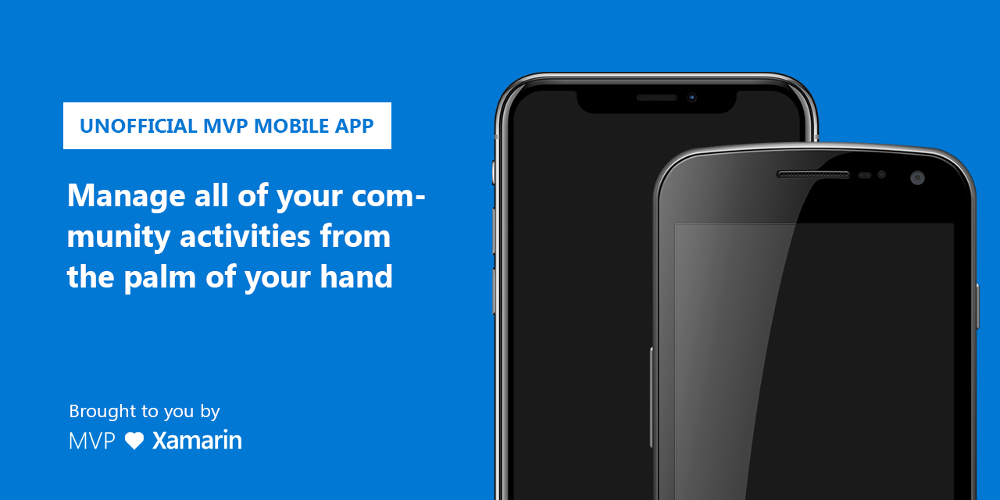

# MVP

There has always been the need for Microsoft MVPs to manage their community activities in an easier way. The online portal works fine, but having a similar thing in your pocket to create activities on the fly is what we really need. Which is what this project is for! Here are some of the awesome features that this app has:

- Create/edit/delete contributions from your MVP profile
- Quickly create contributions based on a URL on your clipboard
- Light/dark mode
- Multilingual 🇺🇸🇫🇷🇩🇪🇪🇸🇭🇺🇳🇱🇦🇹🇸🇪🇹🇷🇨🇭
- iOS and Android

## Some screenshots

## I have a great idea for a feature!

First of all, let's discuss things! I've made issues for a lot of the features I would personally like to see within the realm of current possibilities. Feel free to discuss in the existing isses, make new issues/features etc. etc. If you want to pitch in with code, simply take a look at the issues currently filed, which should contain some of the basic functionalities the app should be able to perform. Does one of them appeal to you? Go ahead and pick it up, let us know and submit a PR when you're done!
